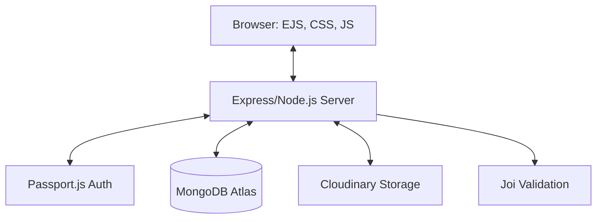
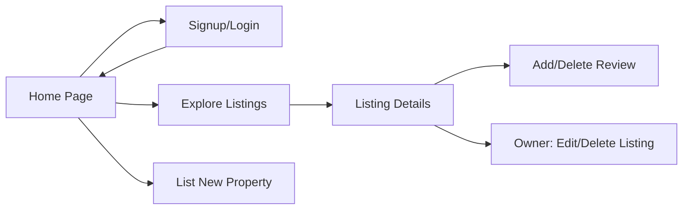

# HeartRoofers

HeartRoofers is a user-friendly web application that simplifies the process of finding and listing rental properties. Whether you're a tenant looking for a new home or a property owner wanting to reach potential tenants, HeartRoofers provides a seamless platform to connect both parties.

## 🚀 Features

- **Advanced Searching** – Quickly find properties based on location, price and state .
- **Verified Listings** – All listings are verified to ensure authenticity and reliability.
- **Direct Communication** – Contact property owners directly through the platform.
- **Responsive Design** – Fully responsive interface for smooth experience on desktop and mobile devices.

## 🌐 Live Demo

Experience HeartRoofers live: [https://heartroofers.onrender.com/](https://heartroofers.onrender.com/)

## 🛠️ Tech Stack

- **Frontend:** HTML5, CSS3, JavaScript
- **Backend:** Node.js, Express.js
- **Database:** MongoDB Atlas
- **Hosting:** Render.com
- **Cloud Storage:** Cloudinary (for images)

## 🏗️ Project Architecture

### System Architecture

### User Flow

## ✨ Recent Technical Improvements
I've recently enhanced the platform with premium UI/UX features and robust security:
- **Premium Confirmation UI**: Replaced native browser alerts with a custom, glassmorphism-styled confirmation modal for all critical actions (Logout, Deletion).
- **Modern Notification System**: Overhauled the alert system with smooth animations, contextual icons, and glassmorphism effects.
- **Robust Phone Validation**: Implemented strict 10-digit phone number validation on both frontend and backend (Joi regex).
- **Streamlined Onboarding**: Added auto-login functionality after successful signup and context-aware CTA buttons on the home page.

## 📦 Installation

To run HeartRoofers locally:

1. **Clone the repository:**  
  git clone https:https://github.com/divysaxena24/HeartRoofers.git  
  cd HeartRoofers

2. **Install dependencies:**  
     npm install

3. **Configure environment variables:**  
  Create a `.env` file in the root directory and add:  
  PORT=8080  
  MONGO_URI=your_mongodb_connection_string  
  JWT_SECRET=your_secret_key  

4. **Start the development server:**  
   node app.js 

5. Visit [http://localhost:3000](http://localhost:8080) to see the app in action.    

## Video Walkthrough

https://github.com/user-attachments/assets/2f927db1-6298-4ef3-a9c8-66592e8da7f5

## ScreenShots

## 🤝 Contributing

We welcome contributions to improve HeartRoofers. To contribute:

1. **Fork the repository.**

2. **Create a new branch:**  
   git checkout -b feature/YourFeature

3. **Make your changes and commit them:**  
   git commit -m "Add new feature"

4. **Push to your branch:**  
    git push origin feature/YourFeature

5. **Open a Pull Request** and describe your changes.
